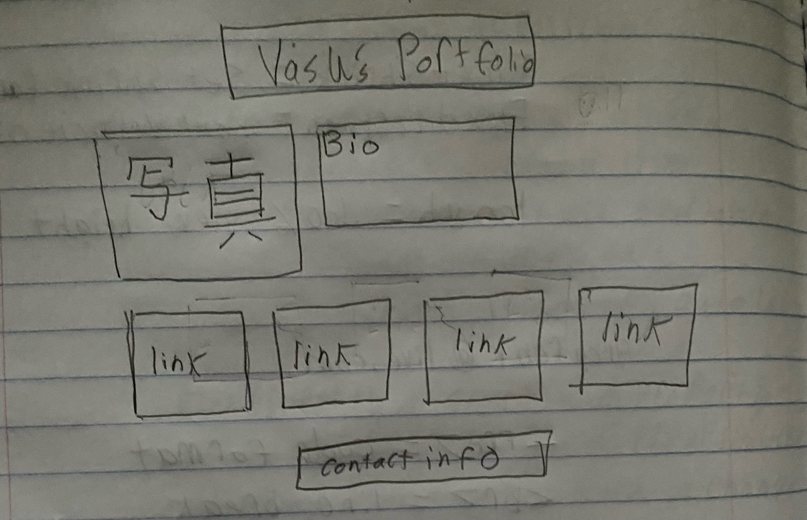
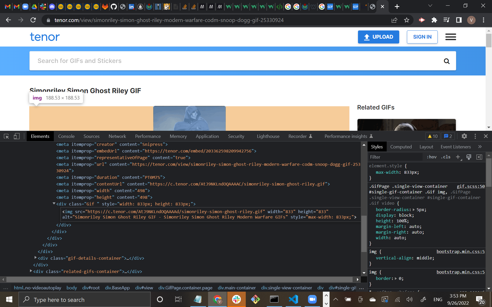
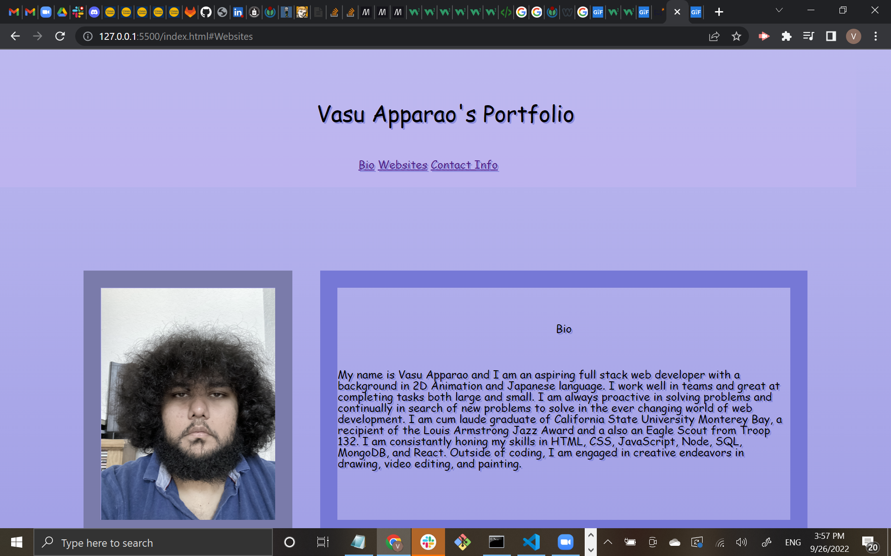
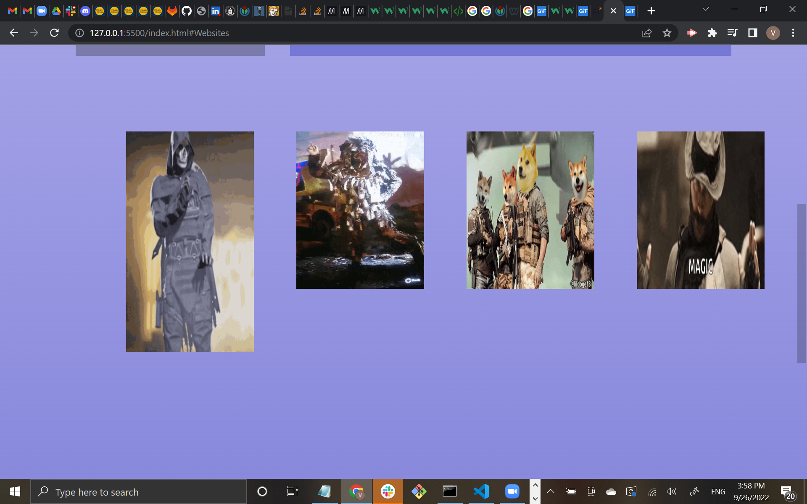
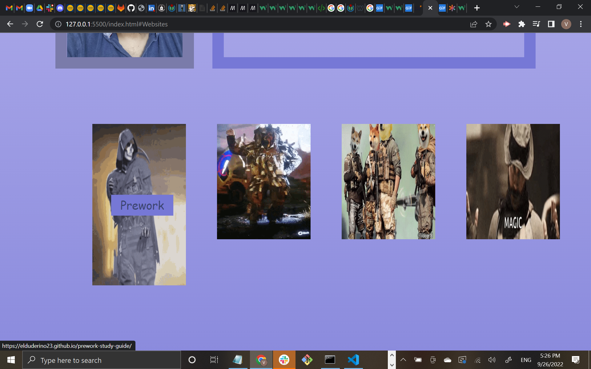
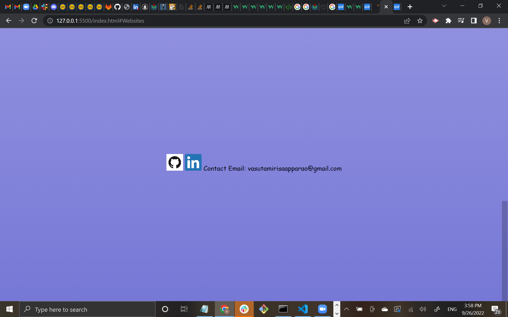

# <Vasu Apparao's Portfolio>

## Goal

This portfolio purpose is a stepping stone meant to open doors into the ever changing world of web development. The portfolio website demonstrates the ability to:
    
    - Make a webpage that aesthetically pleasing to anyone who clicks on the webpage
    - Contains hover enabled labels on gif that when clicked on send the user to different websites that make up the portfolio's body of work
    - Links to different parts of the webpage that are easily accessible
    - Compatable on multiple browsers and devices

## Technology Use

    -CSS
    -HTML
    -Git Bash
    -VS Code
    -GitHub

## Execution

In order to tackle the daunting task of building a portfolio website from scratch, one must come up with a plan of attack. The wireframe behind this portfolio started with a crude yet effective sketch on a sheet of paper like the one below:

After the general idea was formed and put on a sheet of paper, the next task was to create a skeleton of the website through the html file. The decision was made early on to make clickable gifs that sent the user to different websites reflective of the portfolio. This was done through inspecting the console and coping the the following src= " " seen here:

 Once the structure of the html was created with appropriate semantic tags and class structures, the metaphorical meat and bones of the project began, the css. At first difficult, a combination of trial and error and massive amounts of research culminated in making a robust style.css compatable with the website.

## Result
The end product resulted in three parts.
The head of the website seen below directs the user to three sections: Bio, Websites, and Contact Info. Each button in the top part of the website seen in the first picture below navigates the user to any of the three sections of the webpage.:

The Bio page seen below the title of the webpage describes the background of the creator and stated goals for entering the world of web development. It is short and to the point for easy accessibility for future employers with a cursive font that is also aethsically easy on the eyes.

Below is a picture of the second section of the Portfolio, Websites.

There was a conscious decision to choose gifs over a static image in order to give the website itself more jovial tone to the presentation. No one likes to look at a boring standard webpage, especially future employers. A simple gif that links to other websites is one thing but these are not ordinary send off points. Contained in each gif is a title of a website that show the name of the website the user wishes to click to but it only shows the name when the mouse icon hovers over the gif image.

The picture below demostrates this:

Using a hover overlay created in styl.css, it creates of the effect of a title text fading in and out depending on the placement on the mouse cursor itself. It's one of many stylistic choices made to make traversing the webpage easily accessible to the user.

The last portion of the portfolio webpage itself is the Contact Info section seen below:

It's minimal design makes it easy and straight to the point. Each of the two picture presented represents links to contact info for future employers/users to access the creators's Linkedin and Github pages. the text email is straightforward text that the user can copy and send an email to the creator.

Whether it is mobile or on an desktop pc, this porfolio is easily accesible to the user.

Embedded in the REAMDE file is the link to the portfolio below:

https://elduderino23.github.io/apparao-vasu-portfolio/

## License
Copyright (c) 2022 Elduderino23

Permission is hereby granted, free of charge, to any person obtaining a copy
of this software and associated documentation files (the "Software"), to deal
in the Software without restriction, including without limitation the rights
to use, copy, modify, merge, publish, distribute, sublicense, and/or sell
copies of the Software, and to permit persons to whom the Software is
furnished to do so, subject to the following conditions:

The above copyright notice and this permission notice shall be included in all
copies or substantial portions of the Software.

THE SOFTWARE IS PROVIDED "AS IS", WITHOUT WARRANTY OF ANY KIND, EXPRESS OR
IMPLIED, INCLUDING BUT NOT LIMITED TO THE WARRANTIES OF MERCHANTABILITY,
FITNESS FOR A PARTICULAR PURPOSE AND NONINFRINGEMENT. IN NO EVENT SHALL THE
AUTHORS OR COPYRIGHT HOLDERS BE LIABLE FOR ANY CLAIM, DAMAGES OR OTHER
LIABILITY, WHETHER IN AN ACTION OF CONTRACT, TORT OR OTHERWISE, ARISING FROM,
OUT OF OR IN CONNECTION WITH THE SOFTWARE OR THE USE OR OTHER DEALINGS IN THE
SOFTWARE.

